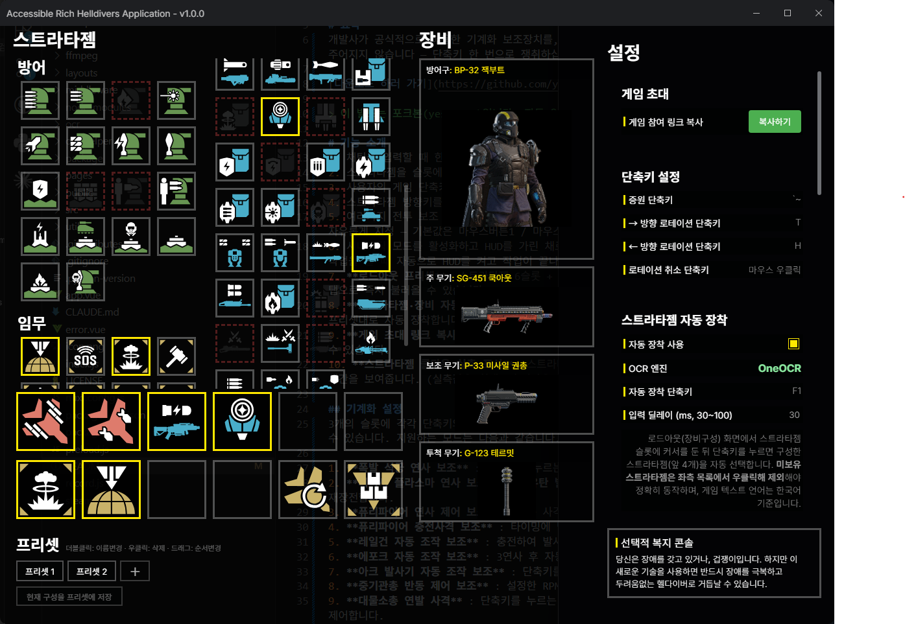

# 요약
개발사가 공식적으로 허용한 기계화 보조장치를, 세련된 인터페이스와 유저경험장치로 녹여낸 민주주의의 역작입니다. 자유는 거저 주어지지 않습니다 — 단축키 한 번으로 쟁취하십시오.

[다운로드 하러 가기](https://github.com/yes89929/helldivers2_helper/releases)

> 이 빌드는 포크본(yes89929)입니다. 자동 업데이트는 꺼져 있으니, 새 버전은 위 릴리스 페이지에서 직접 받아 설치하세요.

# 기능 소개
1. 채팅을 입력할 때 한글 입력이 가능한 확장된 입력 공간을 호출합니다.
2. 스트라타젬을 슬롯에 등록하고 T키와 H키로 선택하면 자동으로 사용해줍니다. (달리거나 걷는 중에도 문제 없이 사용됨)
3. 사용자의 게임 단축키 설정을 자동으로 읽어 별다른 연동 설정이 필요 없습니다.
4. 스트라타젬 방향키를 마우스로 조작해 사용할 수 있습니다.
5. 여러가지 전투 보조 기능인 기계화 설정으로 엄청난 전투력 향상을 가져올 수 있습니다. (3개 슬롯에 무기 모드와 단축키를 각각 자유롭게 지정 — 기본값은 마우스버튼1 / 마우스버튼2 / 마우스휠클릭)
6. 시네마틱 모드를 활성화하고 HUD를 가린 채로 플레이하면, 지도보기·스트라타젬콘솔·채팅·무기 기능 변경 등 UI가 필요한 작업을 할 때 자동으로 HUD를 켜고 작업이 끝나면 다시 가려줍니다.
7. **로드아웃 프리셋**: 스트라타젬 6슬롯 + 미션 스트라타젬 + 장비 4종(방어구/주무기/보조무기/투척)을 프리셋으로 저장하고, 탭으로 즉시 불러올 수 있습니다.
8. **스트라타젬·장비 자동 장착**: 로드아웃 화면에서 단축키를 누르면 OCR로 현재 커서 위치를 인식하고 그리드를 탐색해 프리셋대로 자동 장착합니다. (미보유로 표시한 항목은 건너뜀)
9. **게임 초대 링크 복사**: 현재 참가 중인 로비의 초대 링크(`steam://joinlobby`)를 클립보드에 복사해 동료에게 바로 공유할 수 있습니다.
10. **스트라타젬 쿨다운 실측 표시**: 스트라타젬 콘솔을 연 동안 화면의 쿨다운 숫자를 OCR로 읽어, 오버레이에 실제 남은 시간을 보여줍니다. (실측값은 흰색, 추정값은 회색으로 구분 — 이 기능은 OneOCR 엔진이 있어야 동작합니다)

## 기계화 설정
3개의 슬롯에 각각 단축키와 무기 모드를 지정할 수 있으며, '재장전 속도 증가 갑옷 착용 여부' 옵션으로 재장전 타이밍을 보정할 수 있습니다. 지원하는 모드는 다음과 같습니다.

1. **폭발 석궁 연사 보조** : 단축키를 누르는 동안 폭발 석궁을 매우 빠르게 연사하고, 탄을 모두 쓰면 자동 재장전합니다.
2. **퍼니셔 플라스마 연사 보조** / **유탄 발사기 연사 보조** : 각 무기의 발사 수를 추적해 빠르게 연사하고 자동 재장전합니다.
3. **퓨리파이어 연사 제어 보조** : 연속 사격하면서 반동 제어 감도 값만큼 반동을 자동 보정합니다.
4. **퓨리파이어 충전사격 보조** : 타이밍에 맞춰 충전 발사를 반복합니다.
5. **레일건 자동 조작 보조** : 충전하여 발사하면 자동으로 재장전하고, 과충전 임계 시간에 도달하면 자동으로 발사합니다.
6. **에포크 자동 조작 보조** : 3연사 후 자동으로 재장전합니다.
7. **아크 발사기 자동 조작 보조** : 단축키를 누르는 동안 충전되어, 발사 가능한 상태가 되면 자동으로 연사합니다.
8. **중기관총 반동 제어 보조** : 설정한 RPM으로 연속 사격하며, 반동 제어 감도 값만큼 반동을 자동으로 제어합니다.
9. **대물소총 연발 사격** : 단축키를 누르는 동안 연사하고 7발 발사 시 재장전하며, 반동 제어 감도 값만큼 반동을 자동 제어합니다.

> 반동 제어 감도 : 해상도·감도 설정에 따라 연발 사격 시 제어할 반동값입니다. 탄착군이 아래로 내려가면 값을 내리고, 위로 올라가면 값을 올리세요. (퓨리파이어·중기관총·대물소총 각각 별도 설정)

## 자동 다시보기 녹화
1. 단축키(기본 F1)를 누르면 설정한 길이만큼 영상을 저장합니다. 영상은 `내 문서\동영상\HELLDIVERS 2` 폴더에 저장됩니다.
2. 게임 창이 활성화된 동안 계속 녹화되며, 자동 녹화 초당 프레임·화질 프리셋(원본/고화질/균형/웹배포용/저화질)·최대 녹화 시간을 조정할 수 있습니다. 모니터가 2개 이상이면 녹화할 디스플레이를 선택할 수 있습니다.
3. **데스캠** : 사망을 자동으로 감지해 사망 직전 장면을 저장하고 화면에 미리 보여줍니다. 녹화 길이(사망 전 초)·캡처 지연(사망 후 초)·미리보기 크기·최대 보관 개수를 설정할 수 있고, 용량 절감을 위한 WebP 변환을 지원합니다.

# 알려진 문제들
## 스트라타젬 사용
1. 정적 추정 쿨다운은 정확하지 않을 수 있습니다. 콘솔을 열면 OCR로 실측값을 읽어 보정하지만(흰색 표시), 콘솔을 열기 전까지는 추정값(회색)이 표시됩니다.
## 한글 채팅 확장 기능
1. 너무 빠르게 입력을 시작하면 첫 글자가 무시될 수 있습니다.
2. 가끔 채팅창 입력중 상태를 반대로 인식해 키가 무시되는 경우가 있습니다. (ESC 키로 초기화 가능)
3. 자동 전환이 제대로 동작하지 않으면 '채팅 입력 시 자동 한글 확장'을 끄고, 직접 지정한 한글 채팅 확장 단축키(기본 한/영 키)로 호출해 보세요.
## 시네마틱 모드
1. 스트라타젬 콘솔이나 지도보기 중 수풀에 들어가면 HUD 가리기 토글 순서가 꼬일 수 있습니다. (해결 불가)
## 자동 장착 / OCR
1. OCR·인게임 키바인드·로드아웃 화면 인식은 **한국어 게임 클라이언트** 기준으로 동작합니다.
2. 가장 정확한 OneOCR(윈도우 캡처 도구 엔진)이 없으면 Windows.Media.Ocr로 폴백합니다. 이 경우 장비 자동 장착은 계속 동작하지만 정확도가 떨어질 수 있고, 스트라타젬 쿨다운 실측 표시는 사용할 수 없습니다.
## 실행 환경
1. 다른 프로세스에 입력을 합성하므로 **관리자 권한**으로 실행해야 합니다.

# 참고한 프로젝트
이 프로젝트는 아래 작업들을 참고·기반으로 만들어졌습니다.

- **원본 리포지토리** : [rubystarashe/helldivers2_helper](https://github.com/rubystarashe/helldivers2_helper) — 이 저장소가 포크한 원본 프로젝트입니다.
- **ChubbyMaru/HD2-Helper** : [ChubbyMaru/HD2-Helper](https://github.com/ChubbyMaru/HD2-Helper) — 스트라타젬·장비 자동 장착의 인게임 격자(로드아웃) 네비게이션 로직을 참고·포팅했습니다.

